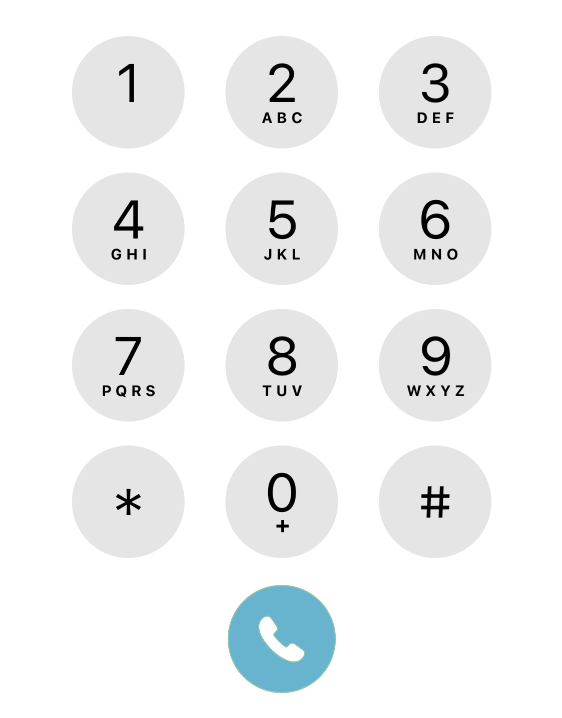

# Number ME

Alfred workflow to convert any string into a single number using the dial pad letter representation.

## Installation

Download and add it to your Alfred workflows.

## Run it

Launch Alfred, type "ne! `string`" and hit enter to get the result number in your clipboard.
